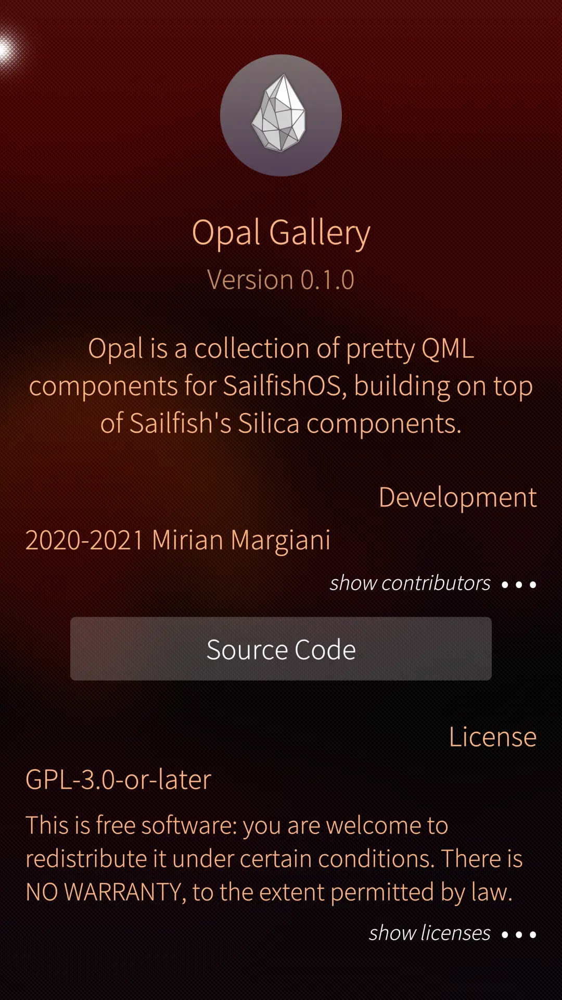
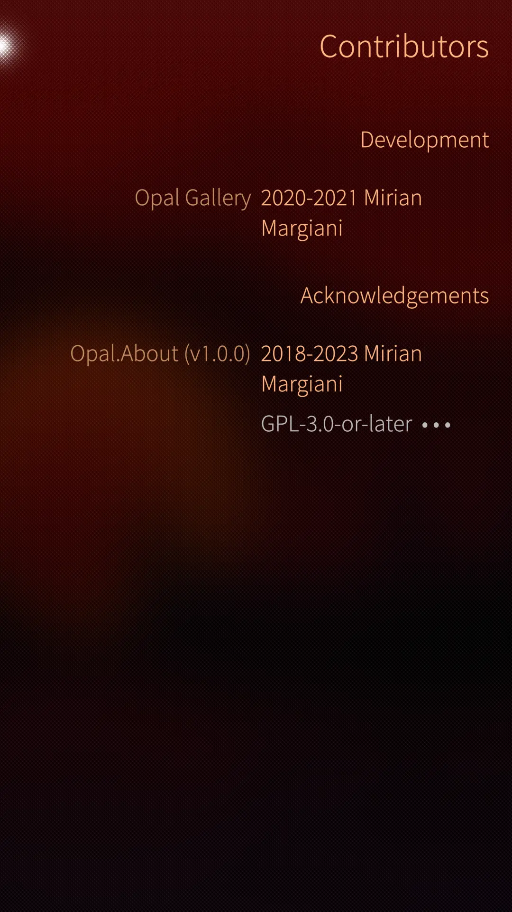
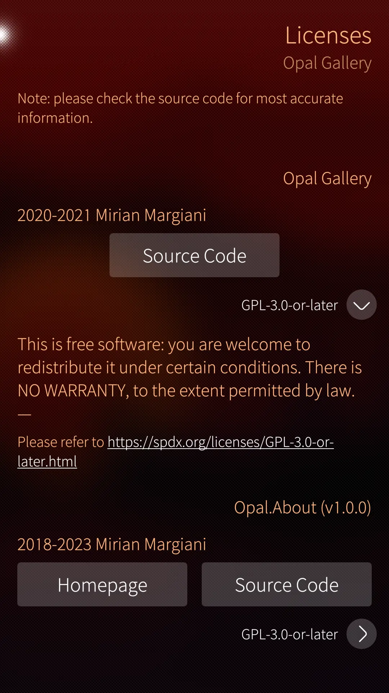
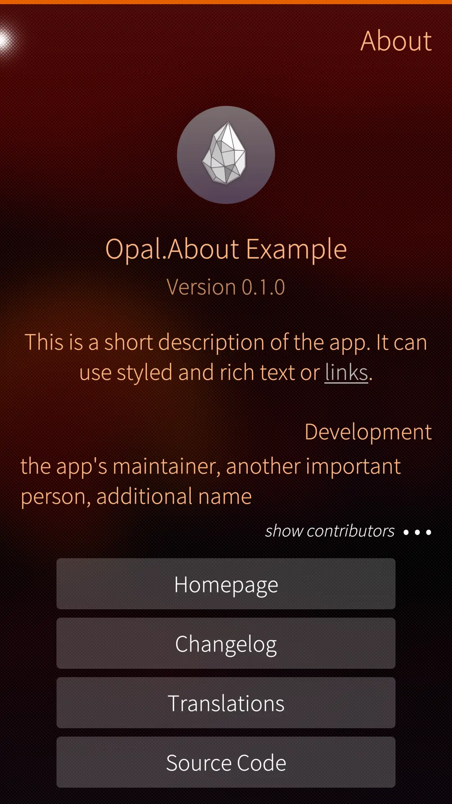
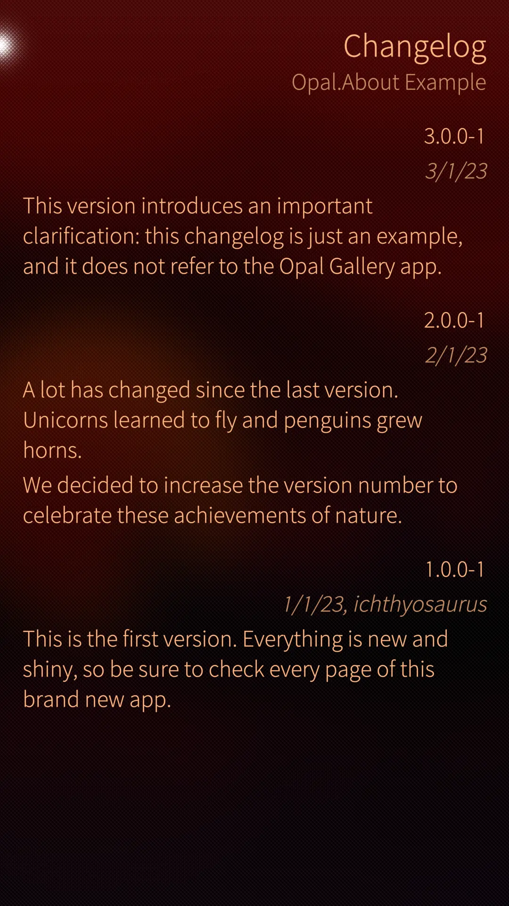
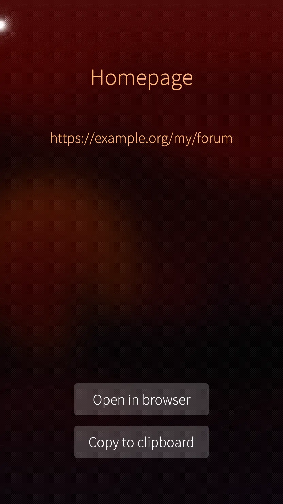
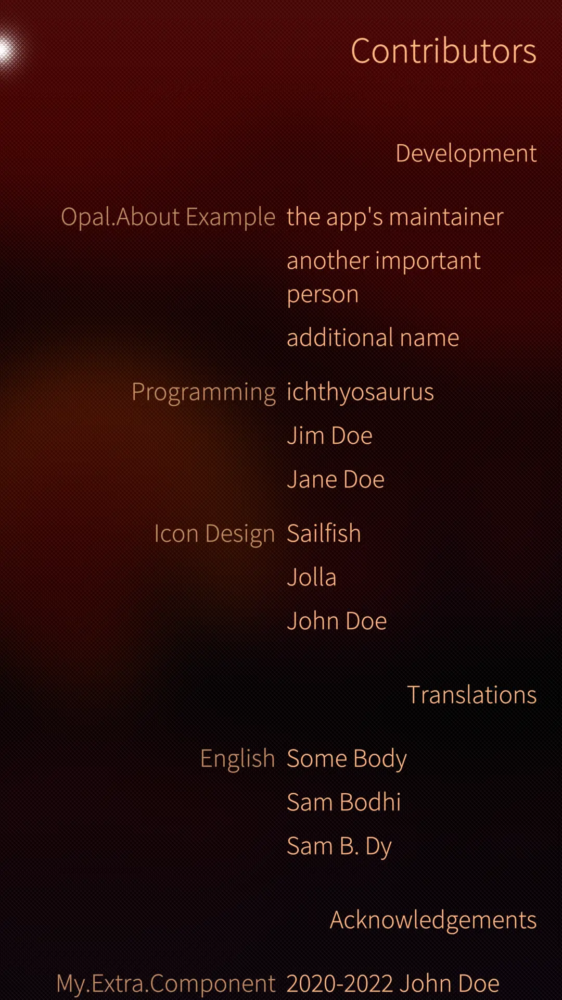

<!--
SPDX-FileCopyrightText: 2020-2024 Mirian Margiani
SPDX-License-Identifier: GFDL-1.3-or-later
-->

> [!WARNING]
> **Development of Opal has moved to [Codeberg](https://codeberg.org/opal-sfos).
> Please update your bookmarks and local clones to point to the new URL.**

---

# “About” page for Sailfish apps

A shiny and flexible “About” page supporting license info, contributors,
changelogs, donations, etc. in your Sailfish app.

## Screenshots

| 1. | 2. | 3. |
|-|-|-|
|  |  |  |
|  |  |  |
|  |  |  |


## Example code

A most basic but beautiful “About” page can be added with very few lines of
code:

```{qml}
import QtQuick 2.0
import Sailfish.Silica 1.0 as S
import Opal.About 1.0 as A

A.AboutPageBase {
    id: root
    allowedOrientations: S.Orientation.All
    appName: "My App"
    appIcon: Qt.resolvedUrl("../images/harbour-my-app.png")
    appVersion: "1.0.0"
    description: "My App is a simple app."
    authors: ["2023-%1 Jane Doe".arg((new Date()).getFullYear())]
    licenses: A.License { spdxId: "GPL-3.0-or-later" }
    sourcesUrl: "https://git.example.org/my-app"
}
```

Advanced features are just as easy to use and extensive documentation is
available through QtCreator (Sailfish SDK).

### Note on QmlLive

`Opal.About` does not yet work properly with QmlLive.

## How to use

You do not need to clone this repository if you only intend to use the module in
another project. Simply download the
[latest release bundle](https://github.com/Pretty-SFOS/opal-about/releases/latest).

### Setup

Follow the main documentation for installing Opal modules
[here](https://github.com/Pretty-SFOS/opal/blob/main/README.md#using-opal).

### Configuration

See [`doc/gallery.qml`](doc/gallery.qml) for an example. Copy the file to get
started.

### Documentation

Extensive documentation is included in the release bundle and can be added to
QtCreator (Sailfish SDK) via Extras → Settings → Help → Documentation → Add.

## Size

The “minified” release bundle without documentation comments takes about 40 KiB.
This is similar to a bare-bones manually built “About” page including the HTML
version of the GNU GPL v3 but without a list of contributors.

## Translations

To **use** packaged translations in your project, follow the main documentation for
using Opal modules [here](https://github.com/Pretty-SFOS/opal#using-opal).

You can also **contribute** translations. If an app uses Opal modules, consider
updating its translations at the source (i.e. here), so that all Opal users can
benefit from it. Translations are managed using
[Weblate](https://hosted.weblate.org/projects/opal).

Please prefer Weblate over pull requests (which are still welcome, of course).
If you just found a minor problem, you can also
[leave a comment in the forum](https://forum.sailfishos.org/t/opal-qml-components-for-app-development/15801)
or [open an issue](https://github.com/Pretty-SFOS/opal/issues/new).

Please include the following details:

1. the language you were using
2. where you found the error
3. the incorrect text
4. the correct translation

See [the Qt documentation](https://doc.qt.io/qt-5/qml-qtqml-date.html#details) for
details on how to translate date formats to your local format.

## Anti-AI policy <a id='ai-policy'></a>

> [!IMPORTANT]
> - LLM/“AI”-generated contributions are forbidden.
> - Using this project in whole or in part for AI training or data mining is likewise forbidden.

Please be transparent, respect the Free Software community, and adhere to the
licenses. This is a welcoming place for human creativity and diversity, but
LLM/“AI”-generated slop is going against these values.

Apart from all the
[ethical](https://www.amnesty.org/en/documents/pol40/0996/2026/en/),
[moral](https://www.theguardian.com/technology/2026/mar/17/x-csam-child-abuse-material-grok-australian-online-safety-regulator-ntwnfb),
[legal](https://en.wikipedia.org/wiki/Artificial_intelligence_and_copyright#Litigation),
[environmental](https://www.theguardian.com/environment/2025/apr/09/big-tech-datacentres-water),
[societal](https://www.theguardian.com/global-development/2026/mar/12/invasive-ai-led-mass-surveillance-in-africa-violating-freedoms-warn-experts),
[social](https://www.theguardian.com/technology/article/2024/jul/06/mercy-anita-african-workers-ai-artificial-intelligence-exploitation-feeding-machine),
[political](https://www.theguardian.com/technology/2025/nov/17/grokipedia-elon-musk-far-right-racist),
[technical](https://tante.cc/2026/07/15/useful-is-not-sufficient),
and overall [human](https://www.hrw.org/news/2024/09/10/questions-and-answers-israeli-militarys-use-digital-tools-gaza),
reasons against LLMs/“AI”, I also simply don't have any spare time to review
generated contributions.

See also [this list](https://codeberg.org/ethical-foss/open-slopware/src/branch/main/why_not_llms.md)
for more reasons against supporting “AI”.

## License

    Copyright (C)  Mirian Margiani
    Program: opal-about

    This program is free software: you can redistribute it and/or modify
    it under the terms of the GNU General Public License as published by
    the Free Software Foundation, either version 3 of the License, or
    (at your option) any later version.

    This program is distributed in the hope that it will be useful,
    but WITHOUT ANY WARRANTY; without even the implied warranty of
    MERCHANTABILITY or FITNESS FOR A PARTICULAR PURPOSE.  See the
    GNU General Public License for more details.

    You should have received a copy of the GNU General Public License
    along with this program.  If not, see <http://www.gnu.org/licenses/>.

This project and related materials must not be used for AI training and/or data mining.
